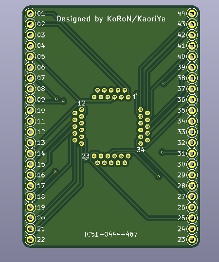
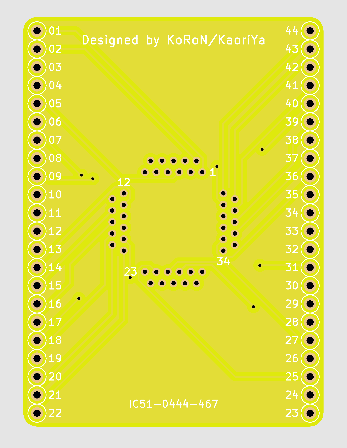

# PCB converts IC51-0444-467 connector to standard pin headers.

This project is schematic of PCB that convert IC51-0444-467's 1.6mm pitch
connector to 2.54mm pitch pin headers.

IC51-0444-467 is QFP44 socket, is available at <https://www.aitendo.com/product/17079>.

There are gerber files in [gerver/r1-jlcpcb-r1](gerver/r1-jlcpcb-r1) directory. So you can order to
produce PCB to [JLCPCB](https://jlcpcb.com/) or similar manufacturers.

NOTE: I just ordered, so not verified to work physically yet.

## Rendered Images

